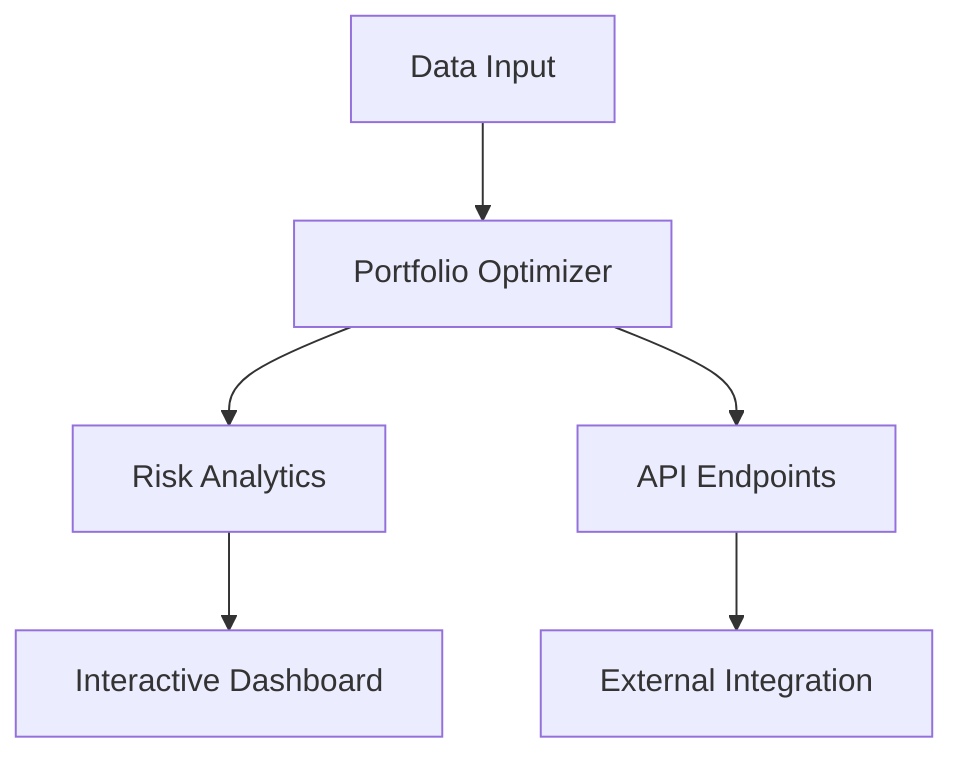

# Quantex Portfolio Analytics


A sophisticated portfolio analytics suite implementing Modern Portfolio Theory (MPT) with interactive visualizations and robust API integration. Built with Python, FastAPI, and advanced mathematical computations for portfolio optimization and risk analysis.

[Live Demo](https://shanetrimbur.github.io/portfolio-analytics/) | [API Documentation](docs/api.md) | [Technical Details](docs/technical.md)

## 🚀 Features

### Portfolio Optimization
- Efficient frontier calculation and visualization
- Multiple optimization targets (Sharpe Ratio, Min Volatility, Max Return)
- Custom constraints and risk parameters
- Real-time weight adjustments

### Risk Analytics
- Value at Risk (VaR) calculation
- Expected Shortfall (CVaR)
- Maximum Drawdown analysis
- Risk-adjusted performance metrics

### Interactive Dashboard
- Real-time portfolio visualization
- Performance attribution
- Risk decomposition
- Asset correlation analysis

## 🛠️ Technology Stack

- **Backend**: Python, FastAPI, NumPy, Pandas, SciPy
- **Frontend**: HTML5, Tailwind CSS, Plotly.js
- **Testing**: pytest, pytest-cov
- **Documentation**: pdoc3, LaTeX

## 📊 Example Usage

```python
from portfolio_analytics.optimizer import PortfolioOptimizer
from portfolio_analytics.risk_metrics import RiskAnalyzer

# Initialize optimizer with historical returns
optimizer = PortfolioOptimizer(returns_data)

# Optimize portfolio
weights, sharpe = optimizer.optimize_sharpe_ratio(risk_free_rate=0.02)

# Calculate risk metrics
risk_analyzer = RiskAnalyzer(returns_data, weights)
metrics = risk_analyzer.calculate_risk_metrics()
```

## 🔄 Architecture



## 🎯 Roadmap

### Phase 1: Enhanced Analytics (In Progress)
- [ ] Factor analysis implementation
- [ ] Machine learning-based risk forecasting
- [ ] Options analytics integration

### Phase 2: Advanced Features (Planned)
- [ ] Real-time market data integration
- [ ] Custom factor modeling
- [ ] Automated portfolio rebalancing

### Phase 3: Enterprise Features (Future)
- [ ] Multi-user support
- [ ] Advanced authentication
- [ ] Custom reporting engine

## 💡 Upcoming Features

1. **Fixed Income Analytics**
   - Duration and convexity calculations
   - Yield curve analysis
   - Credit risk modeling

2. **Alternative Investments**
   - Private equity modeling
   - Real estate analytics
   - Cryptocurrency portfolio integration

3. **ESG Integration**
   - ESG score integration
   - Sustainability metrics
   - Impact investing analytics

## 🔧 Installation

```bash
# Clone the repository
git clone https://github.com/shanetrimbur/portfolio-analytics.git

# Create virtual environment
python -m venv venv
source venv/bin/activate  # On Windows: venv\Scripts\activate

# Install dependencies
pip install -r requirements.txt
```

## 📚 Documentation

- [API Reference](docs/api.md)
- [Technical Documentation](docs/technical.md)
- [Development Guide](docs/development.md)

## 🧪 Testing

```bash
# Run tests with coverage
pytest tests/ --cov=src --cov-report=html
```

## 🤝 Contributing

Contributions are welcome! Please feel free to submit a Pull Request. For major changes, please open an issue first to discuss what you would like to change.

## 📄 License

This project is licensed under the MIT License - see the [LICENSE](LICENSE) file for details.

## 📧 Contact

Shane Trimbur - [LinkedIn](linkedin/in/shanetrimbur) - [Email](mailto:trimbur.careers@gmail.com)

---

*Note: This project is actively developed with new features being added regularly. Check back for updates!*
